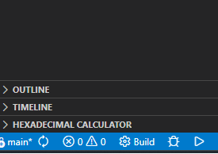

# AVR Template Project

## Prerequisites

1. **Visual Studio Code**
2. **Visual Studio 2026** or higher
3. **AVR Toolchain**: Download from [Microchip - Atmel AVR Toolchain for Windows](https://www.microchip.com/en-us/development-tool/atmel-avr-toolchain-for-windows)
4. **CMake**: Download and install [CMake](https://cmake.org/) version 4.1.2 or higher

## Required Visual Studio Code Extensions

1. **CMake**
2. **C/C++ Extension Pack**

## Toolchain Environment Setup

You must configure your Windows or Linux environment to include the AVR toolchain path. Make sure the toolchain binaries are accessible from your terminal.

## Usage

1. Open a **Developer Command Prompt for Visual Studio**.
2. Navigate to your AVR template project directory:

   ```
   cd <Your Avr Template Route Path>
   ```

3. Launch Visual Studio Code in the project directory:

   ```
   code .
   ```

4. In the bottom left corner of Visual Studio Code, you will see build options. Click **Build** to compile the project.

5.  <!-- Please add a screenshot showing the build options in Visual Studio Code -->

You should now be ready to start programming your Atmega microcontroller!

---
For any issues or questions, please refer to the official documentation or open an issue in this repository.

## Required Visual Studio Code Extensions

1. **CMake**
2. **C/C++ Extension Pack**

## Toolchain Environment Setup

You must configure your Windows or Linux environment to include the AVR toolchain path. Make sure the toolchain binaries are accessible from your terminal.

## Usage

To use this template, open a **Developer Command Prompt for Visual Studio**. This ensures all necessary environment variables are set for building and flashing AVR projects.

---
For any issues or questions, please refer to the official documentation or open an issue in this repository.
